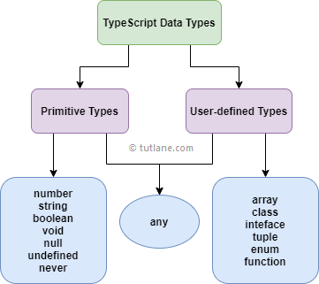

# Typescript 

<details>
<summary>Index</summary>

## Index
* Introduction
* JS vs TS
* Setup
* Execute Typescript
* Typescript Datatypes
* Variable Declaration
* Operators
* Functions
* type & interface
* OOPs
</details>

---

<details>
<summary>Introduction</summary>

## Introduction
* Typescript is a statically typed language.
* Typescript is a superset of Javascript.
* TypeScript includes all features of JavaScript and adds extra features on top.
* TypeScript checks for errors in your code before you run it.
* It verifies that variables and functions have the correct types.
* Typescript is a development tool. if you want to run, you need to convert `TS` into `JS`.
* `Typescript = Type + Javascript`


* Compilation is the process of converting code written in a high-level programming language (like TypeScript) into a lower-level language (like JavaScript) that a computer can execute.


### Type Safety

```ts 
let age: number = 20;
// age = "twenty";  // Error

age = 27;  // No Error
console.log(age); // 27

// console.log(age.toUpperCase()); // Error
```

### Validation

```js
// Javascript 

function addTwo(num){
    if (typeof(num) === number){
        return num+2
    }

    return null;
}

addTwo(5);
```

```ts
// Typescript

function addTwo(num:number){
    return num+2
}

addTwo(5);
```


</details>

---

<details>
<summary>JS vs TS</summary>

## JS vs TS
* JS -> Javascript is a Dynamically Types Language
* TS -> Typescript is a Statically Typed Language

### Javascript
```js
// Javascript

/* -----> variable declaration & re-assignment <----- */ 

let a = 10;
a = 20;
a = "twenty";
a = true;
a = ["Apple", "Banana"];
a = {name:"praveen", age:28};
a = function(){}
a = null;

/* -----> Function Declaration <----- */ 

function user(name, age){
    console.log(name, age);
}

user("praveen", 28);  // praveen 28
user(28, "praveen");  // 28 praveen
user("praveen");  // praveen undefined
user(28);  // 28 undefined
```

### Typescript
```ts
// Typescript 

/* -----> variable declaration & re-assignment <----- */ 

let a:number = 10
a = 20 // No Error

a = "twenty"  // Error
a = true  // Error
a = ["Apple", "Banana"]  // Error
a = function(){}  // Error
a = null  // Error


/* -----> Function Declaration <----- */ 
function user(name:string, age:number):void{
    console.log(name, age)
}

user("praveen", 28)  // praveen 28
user(28, "praveen")  // Error
user("praveen")  // Error
user(28)  // Error
```
</details>

---

<details>
<summary>Setup</summary>

## Setup
1. Install node
2. `npm install -g typescript`
3. convert __TS__ to __JS__ by using TSC (typescript compiler)
   * Example : `tsc index.ts`
4. Run converted `JS` file
    * Example : `node index.js`

### Version Checking 


### Run The Typescript file
* Run the TS file with third-party package
* `npm install ts-node`
* Run TS file -> `ts-node index.ts`

### Realtime Project Setup
1. Install Node
2. `npm init -y` Setup Node Environment -> Create package.json file
3. create `index.html`
4. create two folders :
    * __src__ : development
    * __dist__ : production
5. `tsc --init` create __tsconfig.json__ file
6. create `index.ts` file in src folder
7. modify __tsconfig.json__ file -> __"ourDir":"./dist"__ for tell dist folder path
8. Run the Application on watch mode -> `tsc -w`
   * It automatically generates `JS` file of `TS` in dist folder when changes in __TS__ files.
9. Link generated `JS` file in dist folder to `index.html`
10. Start the Application (index.html) on live-server using __vscode extension live server__.
11. `git init`  && `.gitignore` for untrack the node_modules 
12. Optional -> use third-party-package 
    * `npm install lite-server`
    * Opens the app in the browser and refreshes it when HTML or JavaScript changes.
    * Start : `lite-server` 
13. `npm start` -> start the application

</details>

---

<details>
<summary>Execute Typescript</summary>

## Execute Typescript
1. Create a file with `.ts` extension -> `index.ts`
2. Write Typescript code in the file
3. Compile the Typescript code using `tsc` command -> `tsc index.ts`
4. Run the generated JavaScript file using `node` command -> `node index.js`


</details>

---

<details>
<summary>Typescript Datatypes</summary>

## Typescript Datatypes



</details>

---

<details>
<summary>Variable Declaration</summary>

## Variable Declaration
* use camelCase for variable
* Example : __myName__

### Syntax
* `let variableName:type = value`

### Example
```ts 
let age: number = 20;
// age = "twenty";  // Error

age = 27;  // No Error
console.log(age); // 27
```
### Datatypes
* string
* number
* boolean
* null
* undefined
* any

```ts 
// String
let myName: string = "Ande Praveen";

// number 
let myAge: number = 28;

// boolean
let isMale: boolean = true;

// null 
let test: null = null;

// undefined 
let abc: undefined = undefined;

// any -> we can assign anything like Javascript -> avoid the type checking
let a: any = "Text";
a = 10;
a = true;
a = null;
a = {};
```

</details>

---

<details>
<summary>Operators</summary>

## Operators
1. Arithmetic -> `+, -, *, /, %`
2. Shorthand math -> `+=, -=, *=, /=`
3. Increment/ Decrement -> `++, --`
4. Conditional -> `< , >, <= , >=, !==`
5. Logical -> `&&, ||, !`
6. Ternary -> `?:`

### Example
```ts
let val1:number = 10
let val2:number = 20

let sum:number = val1 + val2
console.log(sum) // 30

sum = 10 + "twenty" // Error
```

</details>

---

<details>
<summary>Functions</summary>

## Functions
* Function Declaration

### Function Declaration
```ts
function square(num:number){
    return num*num
}

// const twoSquare = square("two") // Error -> Argument Type
square(2); // 4  ->  send only number argument
```

### Multiple Arguments

```ts
function signUp(name:string, email:string, age:number){
    console.log(name, email, age)
}

// signUp("praveen", 27, "praveen@example.com") // follow the argument type and order also
signUp("praveen", "praveen@example.com", 27)  // OK
```

### Default Values

```ts

function logIn(name:string, email:string, isPaid:boolean=false){
    console.log(name, email, isPaid)
}
logIn("praveen", "praveen@example.com", true)  // OK
logIn("praveen", "praveen@example.com")  // OK
```


### return type
```ts
function isPositive(num:number):boolean{
    if (num > 0){
        return true
    }
    return false   
}

const result:boolean = isPositive(10)
```

### void
Indicates that a function does not return any value.
```ts
function greet(name: string): void {
    console.log(`Hello, ${name}!`);
}
```

### never return
```ts
// Some functions never returns a value
function handleError(err:string):never{
    throw new Error(err);
}
```

### Iteration
```ts
const numList2 = ["one", "two", "three", 4]
const output2 = numList2.map((num:string | number) => num)
```

</details>

---

<details>
<summary>type & interface</summary>

## type & interface

### type

### interface
* Interface is used to define the shape of an object.
* interface can be extended using the extends keyword.

</details>
---

<details>
<summary>OOPs</summary>

## OOPs
 **OOPs** stands for **Object Oriented Programming** language


```ts 
// Classes Objects

class Mobile {
    /*
    private 
    public 
    protected
    */
    //  private Property and only accessible within class 'Mobile'
    private brand: string;
    private color: string;
    private price: number;

    constructor(brand: string, color: string, price: number) {
        this.brand = brand;
        this.color = color;
        this.price = price;
    }
}


let mobile = new Mobile("Apple", "Red", 35000)
console.log(mobile)
// console.log(mobile.brand)  // Property 'brand' is private and only accessible within class 'Mobile'
```

```ts 
// Classes Objects

class Mobile {
    private brand: string;
    private color: string;
    private price: number;

    constructor(brand: string, color: string, price: number) {
        this.brand = brand;
        this.color = color;
        this.price = price;
    }

    // getter - setter 
    public getBrand(): string {
        return this.brand;
    }

    public setPrice(newPrice: number): void {
        this.price = newPrice
    }

    public getPrice(): number {
        return this.price;
    }
}


let mobile = new Mobile("Apple", "Red", 35000)
console.log(mobile.getBrand())  // Apple

console.log(mobile.getPrice());  // 35000 
mobile.setPrice(1000);
console.log(mobile.getPrice());  // 1000

```

### Inheritance
```ts 
// Inheritance

/*
    Inheritance
    Child inherits the properties and methods of Parent.
    -> re-usability, extends
    
*/

class BasicCalc {
    public result: number;

    constructor() {
        this.result = 0;
    }

    public add(a: number, b: number): void {
        this.result = a + b;
        console.log(this.result)
    }

    public sub(a: number, b: number): void {
        this.result = a - b;
        console.log(this.result)
    }
}


let basicCalc: BasicCalc = new BasicCalc();
basicCalc.add(10, 20); // 30
basicCalc.sub(10, 20); // -10


class AdvCalc extends BasicCalc {
    constructor() {
        super();  // parent class constructor
    }

    // Extending Functionality
    public mul(a: number, b: number): void {
        this.result = a * b;
        console.log(this.result)
    }

    // Method Overriding
    public sub(a: number, b: number): void {
        this.result = a - b - b;
        console.log(this.result)
    }
}


let advCalc = new AdvCalc()
advCalc.mul(10, 20);  // 200

advCalc.add(10, 20); //30
advCalc.sub(40, 10);  // 20

```

### Inheritance 

```ts 
// Interfaces

interface IStudent {
    firstName: string;
    lastName: string;
    age: number;
    course: string;

    fullName: () => string;
    biography: () => void;
}


class Student implements IStudent {
    firstName: string;
    lastName: string;
    age: number;
    course: string;

    constructor(firstName: string, lastName: string, age: number, course: string) {
        this.firstName = firstName;
        this.lastName = lastName;
        this.age = age;
        this.course = course;
    }

    public fullName(): string {
        return `${this.firstName} ${this.lastName}`;
    }

    public biography(): void {
        let bio: string = `
            Full NAME : ${this.fullName()}
            AGE : ${this.age}
            COURSE : ${this.course}
    `;

        console.log(bio)
    }

}


let student = new Student("Arjun", "Reddy", 26, "MBBS");
student.biography(); 
```
</details>

---

<details>
<summary>Modules</summary>

## Modules 

```ts App.ts 
// Modules 

/*
import / export
*/

import { Student } from "./Student";

let student = new Student("Arjun", "Reddy", 26, "MBBS");
student.biography(); 
```

```ts IStudent.ts 
export interface IStudent {
    firstName: string;
    lastName: string;
    age: number;
    course: string;

    fullName: () => string;
    biography: () => void;
}
```

```ts Student.ts 
import { IStudent } from "./IStudent";


export class Student implements IStudent {
    firstName: string;
    lastName: string;
    age: number;
    course: string;

    constructor(firstName: string, lastName: string, age: number, course: string) {
        this.firstName = firstName;
        this.lastName = lastName;
        this.age = age;
        this.course = course;
    }

    public fullName(): string {
        return `${this.firstName} ${this.lastName}`;
    }

    public biography(): void {
        let bio: string = `
            Full NAME : ${this.fullName()}
            AGE : ${this.age}
            COURSE : ${this.course}
    `;

        console.log(bio)
    }
}
```
</details>

---


</details>


* Interface
* implements
* type

```ts
// Nested Object 

interface Address {
    street: string;
    city: string;
    state: string;
    country: string;
}


interface Student {
    name: string;
    age: number;
    course: string;
    address: Address
}
let student: Student = {
    name: "Arjun Reddy",
    age: 25,
    course: "MBBS",
    address: {
        street: "Jubilee hills",
        city: "Hyderabad",
        state: "Telangana",
        country: "India"

    }
}

console.log(student)
```


```ts 
/*
    Array 
*/

// Object Array 
interface Employee {
    sno: string;
    name: string;
    age: number;
    designation: string;
    location: string;
}

let employees: Employee[] = [
    {
        sno: "123",
        name: "Praveen",
        age: 27,
        designation: "Software Engineer",
        location: "Bangalore"
    },
    {
        sno: "124",
        name: "Sweti",
        age: 48,
        designation: "Software Engineer",
        location: "Hyderabad"
    }
];

console.log(employees[1]);


let jrEmployee: Employee[] = employees.filter((emp) => emp.age < 30);
console.log(jrEmployee)
```


```ts 
// Functions 

/*
    If function return something that type if void,
    Otherwise declare a particular type.
*/
let greet = (name: string): void => {
    let msg: string = `Hello ${name}`
    console.log(msg)
};

greet("Praveen")  // Hello Praveen


// function with return Type 
let add = (a: number, b: number): number => {
    let result: number = a + b;
    return result
}
let output: number = add(10, 20);
console.log(output)  // 30

```

```ts 
// Function -> void  -> does not return anything
let greet = (name: string): void => {
    console.log(`Hello ${name}`)
}
greet("Praveen");

// Function -> string  -> it return string
let greet2 = (name: string): string => {
    return name
}
console.log(greet2("Praveen"))

```