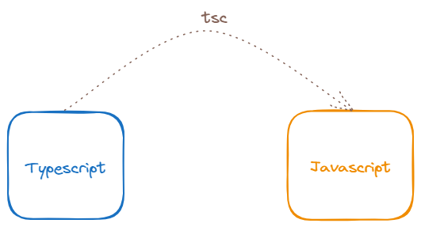
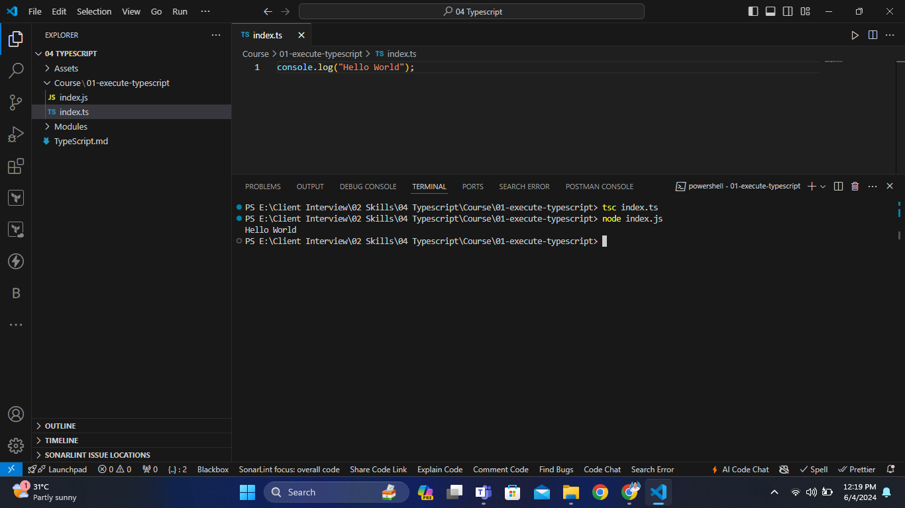
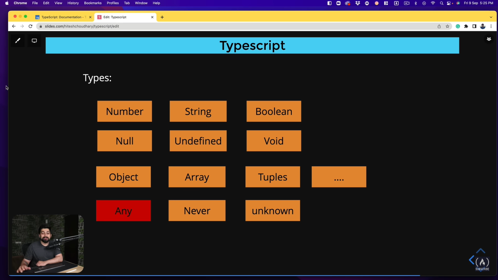

# TypeScript

<details>
<summary>Index</summary>

## Index
* Introduction
* JS vs TS
* Setup
* Execute Typescript
* Typescript Types
* Variable Declaration
* Operators
* Conditionals
* Looping Statements
* Object
* Array
* Functions
* OOps
* Modules
* React Component

</details>

---
<details>
<summary>JS vs TS</summary>

## JS vs TS

### Javascript

```js 
// variable declaration

let a = 10;
a  = 20;  
a  = "text"; 
a = true;
a = ["Apple", "Banana"]; 
a = {name:"Praveen", age:27} ;
a = function(){} 
a = null; 
```

```js 
// Function declaration

let greet = function(name, age){
    ...
};

greet("Praveen", 28);  // valid 
greet(28, "Praveen");  // valid 
greet("john"); // valid 
greet(28); // valid 
```

### Typescript
```ts 
// variable declaration

let a:number = 10;
a  = 20;  // valid 

a  = "text";  // not-valid
a = true;  // not-valid
a = ["Apple", "Banana"];   // not-valid
a = {name:"Praveen", age:27} ;  // not-valid
a = function(){}   // not-valid
a = null;   // not-valid
```

```ts 
// Function declaration

let greet = function(name:string, age:number):void{
    console.log(``);
};

greet("Praveen", 28);  // valid 

greet(28, "Praveen");  // not-valid
greet("john"); // not-valid 
greet(28); // not-valid 
```

</details>

---

<details>
<summary>Setup</summary>

##  Setup
1. install node
2. `npm install -g typescript`
3. Convert Typescript program to Javascript program by using TSC(Typescript converter)  
   * Example : `tsc index.ts`
4. `npm install ts-node`
    - Run Application : `ts-node index.ts`

### version checking 

</details>

---

<details>
<summary>Execute Typescript</summary>

## Execute Typescript

### Steps
1. Create a new file with `.ts` extension
2. Write Typescript code in the file
3. Compile the Typescript code using `tsc` command
4. Run the generated JavaScript file using `node` command





</details>

---

<details>
<summary>Typescript Types</summary>

## Typescript Types


</details>

---

<details>
<summary>Variable Declaration</summary>

## Variable Declaration
use camelCases for variables, for Classes, Interfaces starts with UpperCase
Ex : myName

### Syntax
`let variableName:type = value;`

### Examples

```ts 
let age: number = 20;
// age = "twenty";  // Error
age = 27;  // No Error
console.log(age); // 27
// let output = age.toUpperCase(); // Error
```

### Datatypes
* string
* number
* boolean
* null
* undefined
* any

```ts 
// String
let myName: string = "Ande Praveen";
console.log(`My Name: ${myName}`)

// number 
let myAge: number = 28;
console.log(`My Age: ${myAge}`);

// boolean
let isMale: boolean = true;
console.log(`IsMale: ${isMale}`)

// null 
let test: null = null;
console.log(`Test: ${test}`);

// undefined 
let abc: undefined = undefined;
console.log(`Abc: ${abc}`)

// any -> we can assign anything like Javascript -> avoid the type checking
let a: any = "Text";
a = 10;
a = true;
a = null;
a = {};
```

### Declare a type dynamically

```ts
let salary = 80000;
salary.toFixed();

// salary = "eighty";
salary = 75000;
```

</details>

---

<details>
<summary>Operators</summary>

## Operators 
    1. Arithmetic -> +, -, *, /, %
    2. Shorthand math -> +=, -=, *=, /=
    3. Increment/ Decrement -> ++, --
    4. Conditional -> < , >, <= , >=, !==
    5. Logical -> &&, ||, !
    6. Ternary -> ?:

```ts 
// 01 Arithmetic 

let num1: number = 10;
let num2: number = 20;
console.log(`SUM : ${num1 + num2}`);
console.log(`SUB : ${num1 - num2}`);
console.log(`MUL : ${num1 * num2}`);
console.log(`DIV : ${num1 / num2}`);

// if a number is even /odd 
let digit: number = 16;
if (digit % 2 === 0) {
    console.log(`${digit} is an Even number`);
}
else {
    console.log(`${digit} is an Odd number`);

}


// 02 Shorthand math 
let val1: number = 10;
let val2: number = 20;
let add: number = 10;
// add = add + (val1 * val2); // 10 +(10*20) = 210
add += (val1 * val2);
console.log(add) // 210


// 03 Increment/ Decrement
let x: number = 10;
// x = x + 1;
x++;
console.log(x);  // 11


// 04 Conditional Operators 
let marks: number = 75;
let results: string = "";
if (marks <= 35) {
    results = "You failed the Exam";
}
else {
    results = "You Cleared the Exam";
}
console.log(results)


// 05 Logical Operators

/*
    && -> TT -> T
    || -> FF -> T
    ^ -> diff -> T
*/

let inRelation: boolean = true;
let parentsAgreed: boolean = true;
if (inRelation && parentsAgreed) {
    console.log("Get Marry Soon");
}
else {
    console.log("wait untill parents Agreed")
}


// 06 Ternary 

/*
    (condition) ? true part : false part;
*/


marks = 85;
(marks >= 35) ? results = "You Cleared the Exam" : results = "You failed the Exam";
console.log(results)
```

</details>

---

<details>
<summary>Statements</summary>

## Conditional Statements

### if-else

```ts 
// if-else
let currentTime: number = 10;
let wishMessage: string = "";

if (currentTime >= 0 && currentTime <= 12) {
    wishMessage = "Good Morning";
}
else if (currentTime >= 13 && currentTime <= 17) {
    wishMessage = "Good Afternoon";
}
else if (currentTime >= 18 && currentTime <= 23) {
    wishMessage = "Good Evening";
}
else {
    wishMessage = "Invalid Hrs";
}
console.log(wishMessage)


```

### Jumping Statements

```ts 
// Switch

let day: number = new Date().getDay();
let today: string = ""
switch (day) {
    case 0:
        today = "Sunday"
        break;
    case 1:
        today = "Monday"
        break;
    case 2:
        today = "Tuesday"
        break;
    case 3:
        today = "Wednesday"
        break;
    case 4:
        today = "Thursday"
        break;
    case 5:
        today = "Friday"
        break;
    case 6:
        today = "Saturday"
        break;
    default:
        console.log("Default Day");
        break;
}

console.log(today)
```

### Looping Statements 

## Looping Statements

```ts 
// for-loop

/*

    for (initialization; condition; incr/decr){
        statements
    }

*/


// print the values from 0 - 10
let result: string = "";
for (let i: number = 0; i <= 10; i++) {
    result += `${i} `
}
console.log(result)  // 0 1 2 3 4 5 6 7 8 9 10


// print the values from 10 - 0 

result = ""
for (let i: number = 10; i >= 0; i--) {
    result += `${i} `
}
console.log(result)  // 10 9 8 7 6 5 4 3 2 1 0 


// multiplication between string and number
console.log("*".repeat(5));

```

### while loop 

```ts 
/*
    while loop

    initialize;
    while(condition){
        statements
        incr / decr
    }
*/

let i: number = 0;
let value: string = "";
while (i <= 10) {
    value += `${i} `
    i++
}
console.log(value);  // 0 1 2 3 4 5 6 7 8 9 10 
```
### do-while
```ts 
/*
    do-while : Execute the statement first then check the condition. this is like postpaid but while loop is a prepaid

    initialize;
    do{
        statements
        incr / decr
    }
    while(condition);

*/


let i: number = 0;
let value: string = "";
do {
    value += `${i} `
    i++
}
while (i <= 10);
console.log(value);  // 0 1 2 3 4 5 6 7 8 9 10 
```

</details>

---

<details>
<summary>Object</summary>

## Object 

```ts 
let mobile: { brand: string, color: string, price: number } = {
    brand: "Apple",
    color: "Silver",
    price: 3500
};
console.log(mobile);
```

```ts 
interface Mobile {
    brand: string;
    color: string;
    price: number;
}

let mobileObj: Mobile = {
    brand: "Apple",
    color: "Silver",
    price: 35000
};
console.log(mobileObj);
console.log(mobileObj.brand);
```


```ts
// Nested Object 

interface Address {
    street: string;
    city: string;
    state: string;
    country: string;
}


interface Student {
    name: string;
    age: number;
    course: string;
    address: Address
}
let student: Student = {
    name: "Arjun Reddy",
    age: 25,
    course: "MBBS",
    address: {
        street: "Jubilee hills",
        city: "Hyderabad",
        state: "Telangana",
        country: "India"

    }
}

console.log(student)
```
</details>


---

<details>
<summary>Array</summary>

## Array 

```ts 
// Array
let colors: string[] = ["White", "Green", "Orange"];
console.log(colors)
```

```ts 
let colorsAndNumbers: (string | number)[] = ["White", "Green", "Orange", 34];
console.log(colorsAndNumbers);
```

```ts 
/*
    Arrays 
*/

let colors: string[] = ["white", "black", "red"];
console.log(colors)

let result: string = ""
for (let item of colors) {
    result += `${item} `
}
console.log(result)  // white black red
```

```ts 
/*
    Array 
*/

// Object Array 
interface Employee {
    sno: string;
    name: string;
    age: number;
    designation: string;
    location: string;
}

let employees: Employee[] = [
    {
        sno: "123",
        name: "Praveen",
        age: 27,
        designation: "Software Engineer",
        location: "Bangalore"
    },
    {
        sno: "124",
        name: "Sweti",
        age: 48,
        designation: "Software Engineer",
        location: "Hyderabad"
    }
];

console.log(employees[1]);


let jrEmployee: Employee[] = employees.filter((emp) => emp.age < 30);
console.log(jrEmployee)
```
</details>

---

<details>
<summary>Functions</summary>

## Functions 

```ts 
// Function -> void  -> does not return anything
let greet = (name: string): void => {
    console.log(`Hello ${name}`)
}
greet("Praveen");

// Function -> string  -> it return string
let greet2 = (name: string): string => {
    return name
}
console.log(greet2("Praveen"))

```

```ts 
// Functions 

/*
    If function return something that type if void,
    Otherwise declare a particular type.
*/
let greet = (name: string): void => {
    let msg: string = `Hello ${name}`
    console.log(msg)
};

greet("Praveen")  // Hello Praveen


// function with return Type 
let add = (a: number, b: number): number => {
    let result: number = a + b;
    return result
}
let output: number = add(10, 20);
console.log(output)  // 30

// function with ab object type as parameter
interface Mobile {
    brand: string;
    color: string;
    price: number;
}

let printMobile = (mobile: Mobile): void => {
    console.log(JSON.stringify(mobile))
}

let mobile: Mobile = {
    brand: "Apple",
    color: "Silver",
    price: 35000
}

printMobile(mobile);
printMobile({
    brand: "Lenovo", color: "Black", price: 48000
});
```
</details>

---

<details>
<summary>OOPs</summary>

## OOPs 

 **OOPs** stands for **Object Oriented Programming** language

```ts 
// Classes Objects

class Mobile {
    /*
    private 
    public 
    protected
    */
    //  private Property and only accessible within class 'Mobile'
    private brand: string;
    private color: string;
    private price: number;

    constructor(brand: string, color: string, price: number) {
        this.brand = brand;
        this.color = color;
        this.price = price;
    }
}


let mobile = new Mobile("Apple", "Red", 35000)
console.log(mobile)
// console.log(mobile.brand)  // Property 'brand' is private and only accessible within class 'Mobile'
```

```ts 
// Classes Objects

class Mobile {
    private brand: string;
    private color: string;
    private price: number;

    constructor(brand: string, color: string, price: number) {
        this.brand = brand;
        this.color = color;
        this.price = price;
    }

    // getter - setter 
    public getBrand(): string {
        return this.brand;
    }

    public setPrice(newPrice: number): void {
        this.price = newPrice
    }

    public getPrice(): number {
        return this.price;
    }
}


let mobile = new Mobile("Apple", "Red", 35000)
console.log(mobile.getBrand())  // Apple

console.log(mobile.getPrice());  // 35000 
mobile.setPrice(1000);
console.log(mobile.getPrice());  // 1000

```

### Inheritance
```ts 
// Inheritance

/*
    Inheritance
    Child inherits the properties and methods of Parent.
    -> re-usability, extends
    
*/

class BasicCalc {
    public result: number;

    constructor() {
        this.result = 0;
    }

    public add(a: number, b: number): void {
        this.result = a + b;
        console.log(this.result)
    }

    public sub(a: number, b: number): void {
        this.result = a - b;
        console.log(this.result)
    }
}


let basicCalc: BasicCalc = new BasicCalc();
basicCalc.add(10, 20); // 30
basicCalc.sub(10, 20); // -10


class AdvCalc extends BasicCalc {
    constructor() {
        super();  // parent class constructor
    }

    // Extending Functionality
    public mul(a: number, b: number): void {
        this.result = a * b;
        console.log(this.result)
    }

    // Method Overriding
    public sub(a: number, b: number): void {
        this.result = a - b - b;
        console.log(this.result)
    }
}


let advCalc = new AdvCalc()
advCalc.mul(10, 20);  // 200

advCalc.add(10, 20); //30
advCalc.sub(40, 10);  // 20

```

### Inheritance 

```ts 
// Interfaces

interface IStudent {
    firstName: string;
    lastName: string;
    age: number;
    course: string;

    fullName: () => string;
    biography: () => void;
}


class Student implements IStudent {
    firstName: string;
    lastName: string;
    age: number;
    course: string;

    constructor(firstName: string, lastName: string, age: number, course: string) {
        this.firstName = firstName;
        this.lastName = lastName;
        this.age = age;
        this.course = course;
    }

    public fullName(): string {
        return `${this.firstName} ${this.lastName}`;
    }

    public biography(): void {
        let bio: string = `
            Full NAME : ${this.fullName()}
            AGE : ${this.age}
            COURSE : ${this.course}
    `;

        console.log(bio)
    }

}


let student = new Student("Arjun", "Reddy", 26, "MBBS");
student.biography(); 
```
</details>

---

<details>
<summary>Modules</summary>

## Modules 

```ts App.ts 
// Modules 

/*
import / export
*/

import { Student } from "./Student";

let student = new Student("Arjun", "Reddy", 26, "MBBS");
student.biography(); 
```

```ts IStudent.ts 
export interface IStudent {
    firstName: string;
    lastName: string;
    age: number;
    course: string;

    fullName: () => string;
    biography: () => void;
}
```

```ts Student.ts 
import { IStudent } from "./IStudent";


export class Student implements IStudent {
    firstName: string;
    lastName: string;
    age: number;
    course: string;

    constructor(firstName: string, lastName: string, age: number, course: string) {
        this.firstName = firstName;
        this.lastName = lastName;
        this.age = age;
        this.course = course;
    }

    public fullName(): string {
        return `${this.firstName} ${this.lastName}`;
    }

    public biography(): void {
        let bio: string = `
            Full NAME : ${this.fullName()}
            AGE : ${this.age}
            COURSE : ${this.course}
    `;

        console.log(bio)
    }
}
```
</details>

---


<details>
<summary>React Component</summary>

## React Component
</details>

---